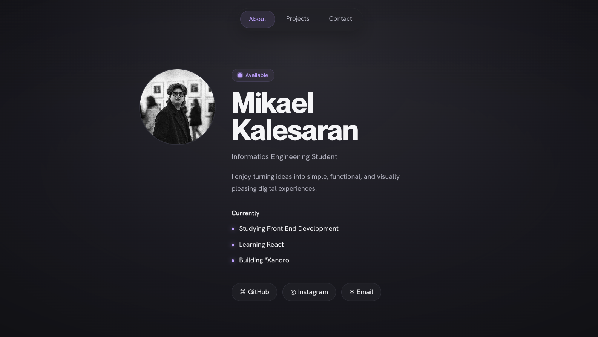

# Mikael Kalesaran

**Building thoughtful digital experiences.**

A minimal portfolio showcasing my projects, design approach, and journey as an Informatics Engineering student.

### 🌐 https://mikaelkalesaran.com

---

## About

Designed and developed from scratch with a focus on simplicity, thoughtful interactions, and modern web experiences.

This portfolio reflects my passion for creating clean, intuitive, and user-focused digital products while continuously learning and improving as a developer.

---

## ✨ Featured Experience

### XANDRO — Personal Dashboard

One of the highlights of this portfolio is **XANDRO**, a custom-built personal dashboard inspired by modern operating systems.

It features a cinematic boot sequence, dynamic greeting system, weather integration, task and goal management, notes, progress tracking, and a live animated background—all built using **HTML, CSS, and Vanilla JavaScript**.

---

## Tech Stack

- HTML5
- CSS3
- Vanilla JavaScript

---

## Visit

**https://mikaelkalesaran.com**

---

Made with Love & Care.

© 2026 Mikael Kalesaran

