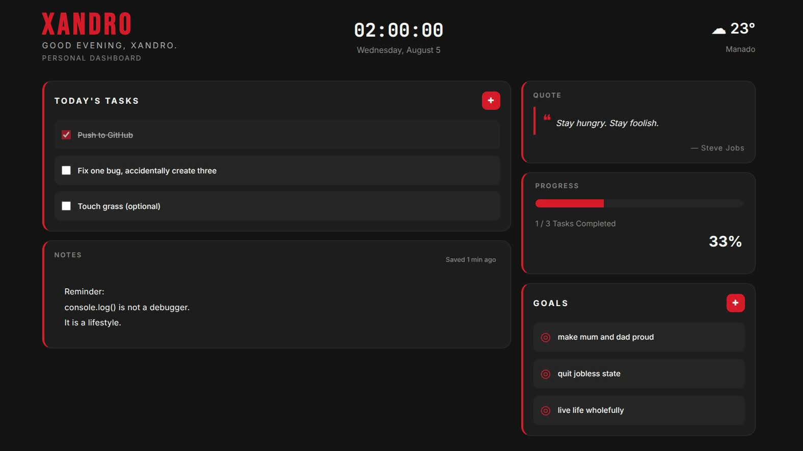

# Xandro

A minimal personal dashboard built with vanilla HTML, CSS, and JavaScript.



## Features

- First-time onboarding
- Personalized greeting
- Live clock and date
- Weather widget
- Daily quotes
- Tasks
- Goals
- Notes
- Progress tracking
- Local storage persistence

## Getting Started

Clone the repository:

```bash
git clone https://github.com/biasedfilms/xandro.git
```

Open `index.html` in your browser.

No build tools or dependencies are required.

## Built With

- HTML5
- CSS3
- JavaScript (ES6)
- OpenWeather API

## Project Structure

```
xandro/
├── assets/
├── css/
├── js/
├── index.html
├── README.md
├── CHANGELOG.md
└── LICENSE
```

## Roadmap

v1.1

- Custom themes
- Multiple accent colors
- Greeting customization

v1.2

- Calendar widget
- Daily streak
- Better statistics

v1.5

Export/Import dashboard

v2.0

- Plugin system
- Multiple layouts
- Drag-and-drop widgets

## License

Released under the MIT License.
